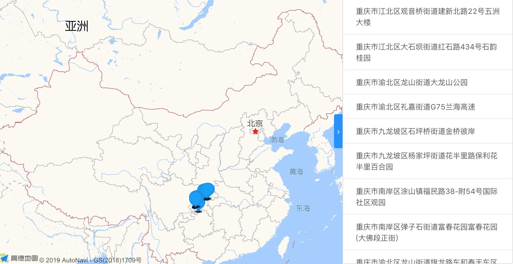

# RAMAP
### 高德地图的 React 实现

## 要求
react >= 16.3.0

## 示例
### 加载地图
```jsx
import React from 'react'
import ReactDOM from 'react-dom'
import {Map, Polyline} from 'ramap'

ReactDOM.render(
  <Map apiKey="your api key" v="1.4.10" >
    <Polyline
      path={[
        [75.757904, 38.118117],
        [97.375719, 24.598057],
        [117.375719, 38.118117]
      ]}
      strokeWeight={6}
      strokeColor="#52c41a"
      outlineColor="#fff"
      lineCap="round"
      showDir
      isOutline
      cursor="pointer"
      extData={{id: 1}}
    >
      {
        polyline => {
          polyline.on('click', () => {
            console.log(polyline.getExtData().id)
          })
        }
      }
    </Polyline>
  </Map>,
  document.getElementById('app')
)
```
### 自定义普通组件
```javascript
import {withProps} from 'ramap'

export default withProps(props => {
  const {children, ...config} = props
  const instance = new window.AMap.Text(config)
  children && children(instance)

  return instance
})
```
### 自定义 UI 组件
```javascript
import withUI from './withUI'

export default withUI('ui/overlay/SimpleMarker')(({props, instance}) => {
  const {children} = props

  /*
    instance 此处代表 SimpleMarker 实例
    可以在此处对 instance 进行操作
  */
  children && children(instance)

  return null
})
```

## 内置组件
### 普通组件：
- Polyline
- Polygon
- InfoWindow
### 插件
- Geocoder
- ToolBar
### UI 组件
<!-- - PathSimplifier -->
- PointSimplifier
- SimpleMarker
### Map
#### 父组件：无
#### 属性
- apiKey: &lt;String&gt; 您申请的 key 值
- v: &lt;String&gt; js API 版本

> 其它支持的属性请参照[此处](https://lbs.amap.com/api/javascript-api/reference/map)

### Polyline
#### 父组件：Map
> 支持的属性请参照[此处](https://lbs.amap.com/api/javascript-api/reference/overlay#polyline)

### Polygon
#### 父组件：Map
> 支持的属性请参照[此处](https://lbs.amap.com/api/javascript-api/reference/overlay#polygon)

### InfoWindow
#### 父组件：Map
> 支持的属性请参照[此处](https://lbs.amap.com/api/javascript-api/reference/infowindow#InfoWindow)

### Plugin
#### 父组件：Map

### Geocoder
#### 父组件：Plugin
> 支持的属性请参照[此处](https://lbs.amap.com/api/javascript-api/reference/lnglat-to-address#m_AMap.Geocoder)

### ToolBar
#### 父组件：Plugin
> 支持的属性请参照[此处](https://lbs.amap.com/api/javascript-api/reference/map-control#AMap.ToolBar)

### UI
#### 父组件：Map

<!-- ### PathSimplifier
#### 父组件：UI
> 支持的属性请参照[此处](https://lbs.amap.com/api/javascript-api/reference-amap-ui/mass-data/pathsimplifier) -->

### PointSimplifier
#### 父组件：UI
> 支持的属性请参照[此处](https://lbs.amap.com/api/javascript-api/reference-amap-ui/mass-data/pointsimplifier)

### SimpleMarker
#### 父组件：UI
> 支持的属性请参照[此处](https://lbs.amap.com/api/javascript-api/reference-amap-ui/overlay/simplemarker)

### Sider
#### 父组件：Map
#### 属性
- children &lt;ReactElement&gt;
> 此组件为自定义组件，在右侧展示悬浮侧边栏。


## 高阶组件
### withUI
主要用于自定义 UI 组件
```javascript
/*
 * context:
 * - props: 组件接收的属性值
 * - instance: UI 模块实例
 * - map: 模块所处的高德地图实例
 * - Module: UI 模块类
 */
withUI('UI 模块名称，例如：ui/misc/PointSimplifier')(context => {
  // 你的逻辑
  return null
})
```

### withProps
主要用于自定义普通组件
```javascript
withProps(props => {
  const {children, ...config} = props
  const instance = new window.AMap.Text(config)
  children && children(instance)

  return instance
})
```

## 注意
- 所有组件均不需要传递 map 参数  
- 组件接收一个函数作为 children
  - 函数参数为实例化的高德模块，这样可以在函数中通过 js 对实例进行事件绑定、初始化等任意操作
  - 此函数在组件生命周期内只会执行一次
  - **建议在自定义组件时也这样做**
- 自定义普通组件时函数需以高德实例作为返回值，自定义 UI 组件则不需要
